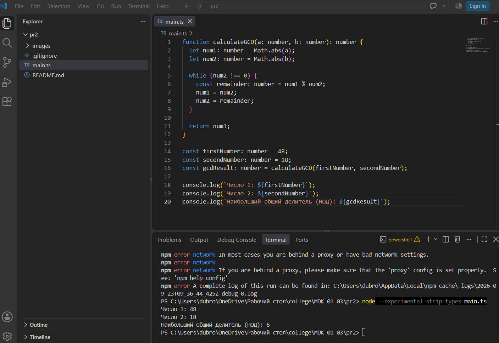

### Практическая работа 1. Основы TypeScript - переменные и функции

## Вариант 8: Вычисление периметра прямоугольника

### Задание
Напишите программу, которая вычисляет НОД двух чисел.

### Код программы
```ts
function calculateGCD(a: number, b: number): number {
  let num1: number = Math.abs(a);
  let num2: number = Math.abs(b);

  while (num2 !== 0) {
    const remainder: number = num1 % num2;
    num1 = num2;
    num2 = remainder;
  }

  return num1;
}

const firstNumber: number = 48;
const secondNumber: number = 18;
const gcdResult: number = calculateGCD(firstNumber, secondNumber);

console.log(`Число 1: ${firstNumber}`);
console.log(`Число 2: ${secondNumber}`);
console.log(`Наибольший общий делитель (НОД): ${gcdResult}`);
```

### Скриншоты работы программы
