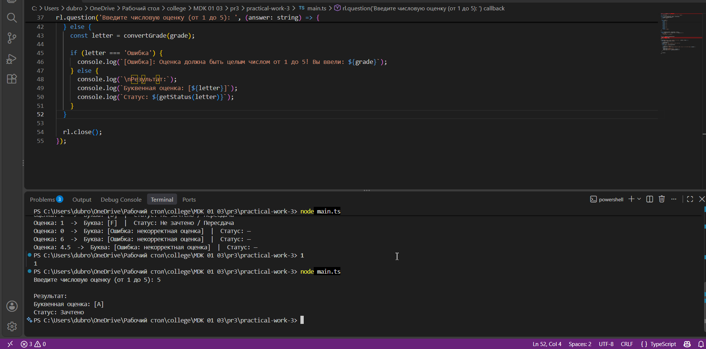
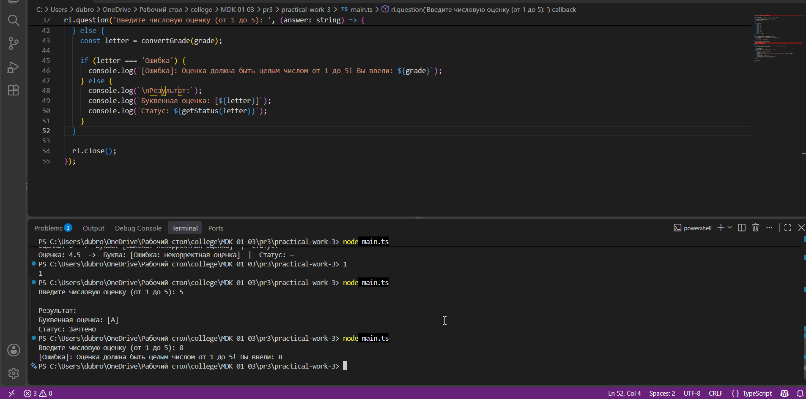

# Практическая работа №2: Условные выражения
## Вариант: 8
## Задание: Написать программу, которая переводит числовую оценку в буквенную (5->A, 4->B и т.д.).

### Код программы:
```typescript
type LetterGrade = 'A' | 'B' | 'C' | 'D' | 'F' | 'Ошибка: некорректная оценка';

function convertGrade(grade: number): LetterGrade {

  if (!Number.isInteger(grade) || grade < 1 || grade > 5) {
    return 'Ошибка: некорректная оценка';
  }

  switch (grade) {
    case 5:
      return 'A';
    case 4:
      return 'B';
    case 3:
      return 'C';
    case 2:
      return 'D';
    case 1:
      return 'F';
    default:
      return 'Ошибка: некорректная оценка';
  }
}

function getExamResult(letter: LetterGrade): string {

  return (letter === 'A' || letter === 'B' || letter === 'C')
    ? 'Зачтено'
    : 'Не зачтено / Пересдача';
}

const testGrades: number[] = [5, 4, 3, 2, 1, 0, 6, 4.5];

console.log('=== Результаты перевода оценок (Вариант 8) ===\n');

for (const grade of testGrades) {
  const letter = convertGrade(grade);
  const status = letter.startsWith('Ошибка') ? '—' : getExamResult(letter);
  
  console.log(`Оценка: ${grade}  ->  Буква: [${letter}]  |  Статус: ${status}`);
}
```

### Скриншоты работы программы:

